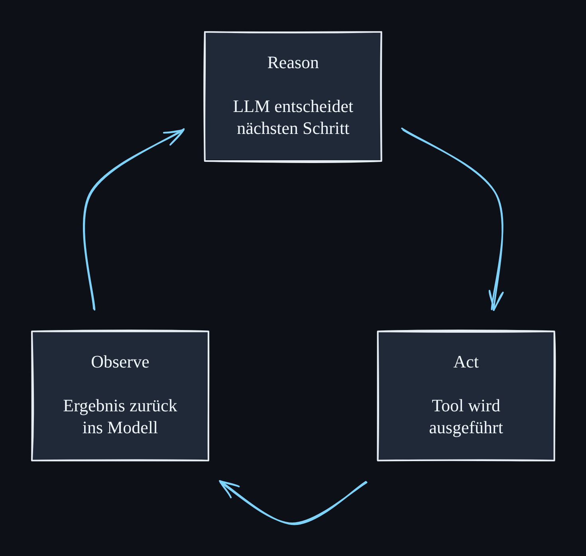

# ki-video-diagrams

Erzeugt aus einer Mermaid-Datei ein sauberes **Excalidraw-Diagramm** im
Whiteboard-Stil — als importierbare `.excalidraw`-Datei plus PNG-Vorschau.
Gebaut für die Diagramme in meinen deutschsprachigen KI-Erklärvideos: dunkles
Theme, große Schrift, gut lesbar auch als kleines Overlay im Screen-Recording.

Für ein neues Video kommt eine neue `.mmd`-Datei in `diagrams/` — der Rest ist
ein Kommando.

📄 Doku-Schicht (Entscheidungen, Kurzfassung) liegt in Google Drive unter
`AIOS/privat/projekte/ki-video-diagrams/`:
<https://drive.google.com/drive/folders/1UArFQZzbYwhXwM41zNllgxq0YAth_JWZ>



## Setup

```bash
npm install
npx playwright install chromium   # einmalig
npm run build                     # Browser-Bundle bauen
```

Der Build-Schritt ist nötig, weil `@excalidraw/mermaid-to-excalidraw` für die
Layout-Berechnung mermaid.js und damit ein echtes DOM braucht. Das Tool startet
deshalb ein headless Chromium (Playwright), lässt die Konvertierung dort laufen
und holt Elemente und PNG wieder heraus.

## Ein Diagramm erzeugen

```bash
npm run generate -- --input diagrams/reason-act-observe.mmd \
                    --out output/reason-act-observe \
                    --layout circle
```

Ergebnis: `output/reason-act-observe.excalidraw` (auf
[excalidraw.com](https://excalidraw.com) per *Datei → Öffnen* importierbar) und
`output/reason-act-observe.png`.

### Optionen

| Option | Default | Bedeutung |
| --- | --- | --- |
| `--input` | – | Pfad zur `.mmd`-Datei (Pflicht) |
| `--out` | – | Ausgabepfad **ohne** Endung (Pflicht) |
| `--layout` | `mermaid` | `mermaid` = dagre-Layout, `circle` = Knoten als Kreis |
| `--theme` | `dark` | `dark` oder `light` |
| `--scale` | `2` | PNG-Auflösung (2 = retina) |
| `--font-size` | `22` | Schriftgröße, an mermaid durchgereicht |
| `--padding` | `40` | Rand um das PNG |
| `--bow` | `0.14` | Wie stark sich die Kreis-Pfeile nach außen wölben |

`CHROMIUM_PATH=/pfad/zu/chrome` nutzt ein bereits vorhandenes Chromium, statt
das von Playwright installierte zu suchen (praktisch in Containern/CI).

## Für ein neues Video

1. Neue Datei in `diagrams/` anlegen, z.B. `diagrams/rag-pipeline.mmd`:

   ```mermaid
   flowchart LR
       A["Frage<br/><br/>Nutzer-Eingabe"]
       B["Retrieval<br/><br/>Passende Chunks<br/>aus dem Index"]
       C["Antwort<br/><br/>LLM formuliert<br/>mit Kontext"]

       A --> B
       B --> C
   ```

2. Erzeugen:

   ```bash
   npm run generate -- --input diagrams/rag-pipeline.mmd --out output/rag-pipeline
   ```

3. PNG anschauen, bei Bedarf `.excalidraw` in excalidraw.com öffnen und von Hand
   nachjustieren.

### Konventionen, die sich bewährt haben

- **Schlagwort, Leerzeile, Beschreibung:** `"Act<br/><br/>Tool wird<br/>ausgeführt"`.
  Die Leerzeile lässt die Kopfzeile beim schnellen Überfliegen heraussstechen —
  wichtig, wenn das Diagramm im Video nur ein Viertel des Bildes einnimmt.
- **Zeilen selbst umbrechen** mit `<br/>`, statt lange Labels automatisch
  umbrechen zu lassen. Ergibt gleichmäßigere Knoten.
- **Zyklen immer mit `--layout circle`.** Mermaid/dagre layoutet hierarchisch
  und macht aus einem Loop sonst eine Reihe mit langem Rückpfeil.

## Aufbau

```
diagrams/   Mermaid-Quelldateien (eine pro Diagramm)
output/     erzeugte .excalidraw- und .png-Dateien
src/
  generate.mjs      CLI: Argumente, Playwright, Dateien schreiben
  browser-entry.js  läuft im Browser: mermaid -> Excalidraw-Elemente
  layout.mjs        Kreis-Layout für zyklische Diagramme
  themes.mjs        Farbschemata (dark/light)
  web/              Web-UI: Prompt bauen -> claude-CLI ausführen -> Ergebnis anzeigen
docs/
  iterations.md     Qualitäts-Loop des ersten Diagramms
```

## Skill: freie Diagramme ohne Mermaid

Unter `.claude/skills/excalidraw-diagram/` liegt der Skill
[coleam00/excalidraw-diagram-skill](https://github.com/coleam00/excalidraw-diagram-skill)
(unverändert, Stand `8646fcc`). Er schreibt Excalidraw-JSON direkt von Hand,
statt über Mermaid — dadurch sind Layouts möglich, die dagre nicht kann:
Timelines, Fan-outs, Code-Snippets als „Evidence Artifacts", frei platzierter
Text ohne Boxen.

**Wann was:**

| | `npm run generate` | Skill `excalidraw-diagram` |
| --- | --- | --- |
| Eingabe | `.mmd`-Datei | Beschreibung in Prosa |
| Layout | mermaid/dagre + `--layout circle` | frei, von Hand platziert |
| Gut für | Flows, Loops, alles Wiederholbare | einmalige, erklärende Video-Diagramme |
| Reproduzierbar | ja, aus der `.mmd` | nein, das JSON ist das Original |

Setup des Skill-Renderers (einmalig, **lokal** — braucht Internet):

```bash
cd .claude/skills/excalidraw-diagram/references
uv sync
uv run playwright install chromium
```

Farben an den Video-Look anpassen: `references/color-palette.md` ist die einzige
Datei, die dafür geändert werden muss.

## Web-UI: Diagramme per Browser erzeugen

Statt den Skill manuell in einer Claude-Code-Session anzustoßen, gibt es unter
`src/web/` eine kleine, mobile-taugliche Weboberfläche. Man beschreibt dort
sein Konzept — frei formuliert oder über einen festen Fragen-Dialog (Thema,
Zielgruppe, Tiefe, Kernkomponenten) — die Seite baut daraus einen Prompt, und
im Hintergrund läuft eine `claude`-CLI-Session, die den Skill
`excalidraw-diagram` ausführt (inkl. dessen Render-View-Fix-Loop). Am Ende gibt
es eine PNG-Vorschau und einen Download-Link für die `.excalidraw`.

**Das Tool ersetzt Excalidraw nicht** — es liefert nur die Ausgangsdatei. Die
Feinarbeit (Positionen, Farben, Text verschieben) passiert danach ganz normal
in Excalidraw selbst.

### Starten

```bash
npm run web
```

Voraussetzungen:
- `.claude/skills/excalidraw-diagram/references` muss einmalig eingerichtet
  sein (siehe oben, `uv sync` + `uv run playwright install chromium`).
- Die `claude`-CLI muss im `PATH` verfügbar und bereits authentifiziert sein.

Der Server läuft dann unter `http://127.0.0.1:5173` (Port über `PORT`
änderbar).

### Sicherheitshinweis — nur lokal, nicht öffentlich hosten

Der Server bindet bewusst nur an `127.0.0.1` und startet `claude` mit
`--dangerously-skip-permissions`, damit die Web-Session ohne manuelles
Freigeben im Terminal durchläuft. Das ist nur vertretbar, solange ausschließlich
der Betreiber selbst Zugriff hat: Skip-Permissions bedeutet, dass jeder
eingereichte Prompt Claude Code dazu bringen kann, beliebige Bash-Befehle auf
dem Server auszuführen. **Bevor diese Oberfläche für andere Personen erreichbar
gemacht wird**, braucht es zusätzlich: Authentifizierung, isolierte/sandboxed
Ausführung pro Job (z.B. Container ohne Zugriff auf Secrets anderer Jobs) und
eine eingeschränkte Tool-Liste statt Skip-Permissions.

## Deployment (Hetzner/Docker)

Für den Dauerbetrieb läuft die Web-UI als Docker-Container auf dem Server
(apps-prod). Die Idee: der Dienst lauscht **nur auf dem Loopback des Hosts**
(`127.0.0.1:5173`), und der Zugriff von unterwegs geht ausschließlich über
**Tailscale** — nie über eine öffentliche Domain.

> **Nie öffentlich routen.** Dieser Dienst darf **nicht** über Caddy oder eine
> öffentliche Domain erreichbar gemacht werden. Der oben beschriebene
> Sicherheitshinweis gilt unverändert: `--dangerously-skip-permissions`
> bedeutet, dass jeder eingereichte Prompt beliebige Befehle im Container
> ausführen kann. Zugriff darum ausschließlich über das private Tailscale-Netz.

### Was im Repo liegt

- `Dockerfile` — Node-LTS-Image mit Projekt-Dependencies, headless Chromium
  (Node **und** Python/`uv` für den Skill-Renderer) und der `claude`-CLI. Läuft
  als non-root User (nötig, damit `claude` `--dangerously-skip-permissions`
  akzeptiert).
- `docker-compose.yml` — Service-Block `ki-video-diagrams`. Port ist bewusst
  nur auf `127.0.0.1:5173:5173` gemappt, `restart: unless-stopped`, benanntes
  Volume `ki-video-output` für `output/`.
- `.env.example` — Vorlage für die Secrets (`CLAUDE_CODE_OAUTH_TOKEN`, `PORT`).

Im Container bindet der Server an `0.0.0.0` (über die Env-Var `HOST`), weil
Dockers Port-Mapping das Loopback *innerhalb* des Containers nicht erreicht. Die
Absicherung nach außen macht das Host-Mapping `127.0.0.1:...` — der Container
selbst ist nur über dieses Loopback-Mapping erreichbar.

### Voraussetzungen zur Laufzeit

- Der Container braucht **ausgehendes Internet** (Claude-API sowie das
  ESM-Modul, das der Skill-Renderer beim PNG-Erzeugen von `esm.sh` lädt).
- Ein gültiger `CLAUDE_CODE_OAUTH_TOKEN` in der Server-`.env` (siehe
  Schritt-für-Schritt unten).

### Schritt für Schritt (Laptop + Server)

Der Reihe nach abarbeiten:

1. **Repo auf den Server holen.** Per SSH auf apps-prod einloggen und das Repo
   an die gewünschte Stelle klonen (oder ein vorhandenes Checkout aktualisieren):

   ```bash
   git clone https://github.com/thexsteven/ki-video-diagrams.git
   cd ki-video-diagrams
   ```

2. **`.env` anlegen.** Vorlage kopieren:

   ```bash
   cp .env.example .env
   ```

3. **Claude-Token erzeugen und eintragen.** Auf dem Server (interaktiv, öffnet
   einen Browser-Login-Flow):

   ```bash
   claude setup-token
   ```

   Den ausgegebenen Token als `CLAUDE_CODE_OAUTH_TOKEN=...` in die `.env`
   eintragen. (Falls `claude` auf dem Server noch nicht installiert ist:
   `npm install -g @anthropic-ai/claude-code`. Der Token wird im Container über
   `env_file: .env` gelesen — im Container selbst musst du dich nicht einloggen.)

4. **Tailscale auf dem Server installieren.** (Einmalig, als root/`sudo`.)

   ```bash
   curl -fsSL https://tailscale.com/install.sh | sh
   sudo tailscale up
   ```

   `tailscale up` zeigt einen Login-Link — im Browser öffnen und mit deinem
   Tailscale-Konto bestätigen. Danach ist der Server Teil deines privaten
   Tailnet. Merke dir seinen Tailscale-Namen bzw. seine 100.x.y.z-Adresse
   (`tailscale ip -4` oder `tailscale status`).

5. **Container bauen und starten.** Im Repo-Verzeichnis:

   ```bash
   docker compose build
   docker compose up -d
   ```

   Prüfen: `docker compose ps` (sollte `running` zeigen) und
   `docker compose logs -f` (sollte `Web-UI läuft auf http://0.0.0.0:5173`
   melden). Lokaler Test auf dem Server selbst:
   `curl -I http://127.0.0.1:5173`.

6. **Tailscale den Dienst servieren lassen.** So wird `127.0.0.1:5173` im
   privaten Tailnet erreichbar — **ohne** es öffentlich zu machen:

   ```bash
   sudo tailscale serve --bg 5173
   ```

   `tailscale serve status` zeigt danach die interne HTTPS-URL
   (`https://<server-name>.<dein-tailnet>.ts.net`). Wichtig: `serve` (privat,
   nur im Tailnet) — **nicht** `funnel` (das wäre öffentlich).

7. **Tailscale auf dem Handy einrichten.** Die Tailscale-App aus dem
   App Store / Play Store installieren, mit **demselben** Tailscale-Konto
   anmelden und Tailscale aktivieren (VPN-Toggle an). Das Handy ist dann im
   selben privaten Tailnet wie der Server.

8. **Vom Handy aus testen.** Bei aktivem Tailscale im Handy-Browser die
   `serve`-URL aus Schritt 6 öffnen
   (`https://<server-name>.<dein-tailnet>.ts.net`). Die Web-UI sollte
   erscheinen — ein Testkonzept eingeben und prüfen, dass eine `.excalidraw`
   (und eine PNG-Vorschau) erzeugt wird.

Neue Version ausrollen später: `git pull` auf dem Server, dann
`docker compose build && docker compose up -d`.

## Das erste Diagramm

`diagrams/reason-act-observe.mmd` — der Agenten-Loop (Reason → Act → Observe →
zurück zu Reason). Es entstand über sieben Runden aus generate → observe →
critique → refine; was in welcher Runde warum geändert wurde, steht in
[`docs/iterations.md`](docs/iterations.md).

## Lizenz

MIT — siehe [LICENSE](LICENSE).
